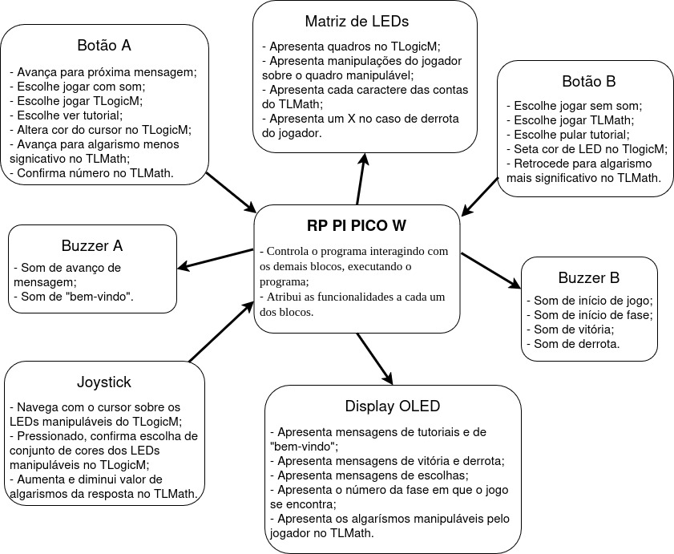
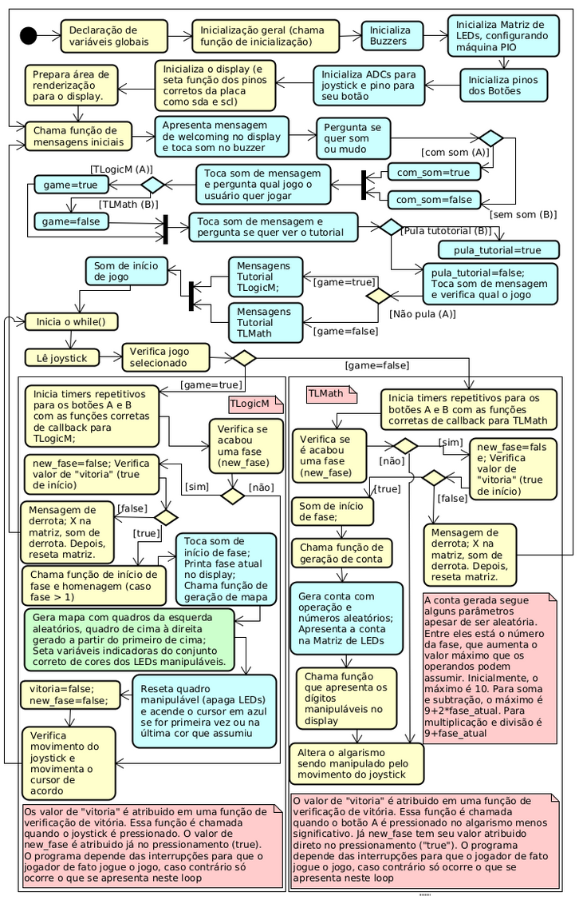

# TLMGame

TLMGame is a game aimed at all audiences, although it is highly suitable for children and teenagers. To this end, the game brings fun and learning together in the form of logic and math tests, allowing players to train their logical reasoning and strengthen their brains! 
 
 
The program consists of two games:
 <ul>
  <li><b>TLogicM:</b> In this game, the player is responsible for reproducing the logic used to transform the top-left square into the top-right square, in order to figure out the bottom-right square using the top logic and the bottom-left square! This logic can be a 90-degree rotation (counterclockwise or clockwise), a 180-degree rotation, or, finally, a color change (e.g., red turns blue and green turns white). It is worth noting, however, that two simultaneous changes cannot occur from one square to another, meaning there will never be a color change accompanied by a rotation.</li>
  <li><b>TLMath:</b> In this one, the player must pay close attention to the math problem presented in each round and input the result they believe is correct. This way, with each level the player passes (each problem they get right), the game increases its difficulty. The problems will contain progressively larger numbers, consequently generating larger and more complex results to figure out. It should be noted that, in each level, there is only one operation: addition, subtraction, multiplication, or division. There is never more than one operation per level! </li>
</ul> 

---

## Bill of Materials (BOM): 

| Component             | BitDogLab Connection      |
|-----------------------|---------------------------|
| BitDogLab (Pi Pico W - RP2040) | -                         |
| MLT-8530 Buzzers      | GPIOs 10 and 21 as PWM outputs |
| 5x5 WS2812B Matrix    | GPIO 7 with PIO configuration |
| I2C OLED Display      | SDA: GPIO14 / SCL: GPIO15 |
| Joystick              | GPIO 22 (pull-up), GPIOs 26 and 27 with ADC|
| Buttons (two)         | GPIOs 5 and 6 (pull-up)   |

---

## Execution

1. Open the project in VS Code, using an environment with Raspberry Pi Pico SDK support (CMake + ARM compiler);
2. Build the project normally (Ctrl+Shift+B in VS Code or via terminal with `cmake` and `make`);
3. Connect your BitDogLab via USB cable and put the Pico into boot mode (hold the BOOTSEL button while plugging in the cable);
4. Copy the generated `.uf2` file to the storage drive that appears (RPI-RP2);
5. The Pico will automatically reboot and start executing the code;
 
Tip: Use the Raspberry Pi Pico extension in VS Code to import the program as a Pico project, using SDK 2.1.0.

---

## Files

- `src/TLMGame.c`: Main project code;
- `src/libraries/buzzer_pwm.c`: .c file of the library for using the buzzer with PWM;
- `src/libraries/buzzer_pwm.h`: .h file of the library for using the buzzer with PWM;
- `src/libraries/joystick.c`: .c file of the library for using the joystick with ADC;
- `src/libraries/joystick.h`: .h file of the library for using the joystick with ADC;
- `src/libraries/neopixel.c`: .c file of the library for using the LED matrix with PIO;
- `src/libraries/neopixel.h`: .h file of the library for using the LED matrix with PIO;
- `src/libraries/ssd1306_i2c.c`: I2C communication library .c file for the OLED display;
- `src/libraries/ws2812b.pio`: .pio file for communication with the LED matrix; 
- `src/libraries/inc/ssd1306.h`: .h file with function definitions for the OLED display I2C communication library (this is included in the main code);
- `src/libraries/inc/ssd1306_font.h`: Main project code;
- `src/libraries/inc/ssd1306_i2c.h`: I2C communication library .h file for the OLED display with definitions and structures;

- `assets/BLK_DIAG.jpg`: Hardware block diagram;
- `assets/circuitos.jpg`: Circuit diagram;
- `assets/flux_software.png`: Software flowchart;
- `assets/diagrama_camadas_soft.jpg`: Software layer diagram;
- `assets/placa_tlogicm.png`: Board operating in the TLogicM game.

---

## 🖼️ Project Images

### BitDogLab operating in the TLogicM game:

### Hardware block diagram:

### Circuit diagram:

### Software flowchart:

### Software layer diagram:

---

## 📜 License
MIT License - MIT GPL-3.0.

---

# TLMGame

TLMGame é um jogo que visa a atender a todo o público, apesar de ser de ótimo uso para crianças e adolescentes. Para tanto, o jogo traz diversão e aprendizado em conjunto na forma de testes de lógica e matemática, permitindo ao jogador que treine seu raciocínio lógico e fortaleça seu cérebro! 
 
 
O Programa é composto por dois jogos:
 <ul>
  <li>TLogicM: Neste jogo, o jogador é responsável por reproduzir a lógica de transformação do quadro da esquerda encima para o da direita em cima, de forma a formar o quadrado da direita embaixo usando a lógica de cima e o quadrado da esquerda de baixo! Tal lógica, pode ser dada por uma rotação de 90 graus nos sentidos anti-horário ou horário, uma rotação de 180 graus ou, finalmente, pela mudança de cores (como: vermelho vira azul e verde vira branco). Vale ressaltar, no entanto, que não podem ocorrer duas mudanças simultâneas de um quadro para o outro, ou seja, nunca haverá uma mudança de cor acompanhada por uma rotação.</li>
  <li>TLMath: Já neste, o jogador tem de ficar muito atento à conta apresentada em cada rodada e devolver ao programa o resultado que pensa ser o correto. Dessa maneira, a cada fase que o jogador passa (cada conta que acerta), o jogo aumenta sua dificuldade, de modo que as contas podem conter números progressivamente maiores, gerando, por consequência, resultados maiores e mais complexos de serem encontrados. Cabe notar que, a cada fase, há apenas uma operação: soma, subtração, multiplicação ou divisão. Nunca há mais que uma operação por fase! </li>
</ul> 

---

##  Lista de materiais: 

| Componente            | Conexão na BitDogLab      |
|-----------------------|---------------------------|
| BitDogLab (Pi Pico W - RP2040) | -                         |
| Buzzers MLT-8530   | GPIOs 10 e 21 como saídas PWM |
| Matriz WS2812B 5x5 | GPIO 7 com configuração PIO |
| Display OLED I2C   | SDA: GPIO14 / SCL: GPIO15 |
| Joystick           | GPIO 22 (pull-up), GPIOs 26 e 27 com ADC|
| Botões (dois)      | GPIOs 5 e 6 (pull-up)|

---

## Execução

1. Abra o projeto no VS Code, usando o ambiente com suporte ao SDK do Raspberry Pi Pico (CMake + compilador ARM);
2. Compile o projeto normalmente (Ctrl+Shift+B no VS Code ou via terminal com cmake e make);
3. Conecte sua BitDogLab via cabo USB e coloque a Pico no modo de boot (pressione o botão BOOTSEL e conecte o cabo);
4. Copie o arquivo .uf2 gerado para a unidade de armazenamento que aparece (RPI-RP2);
5. A Pico reiniciará automaticamente e começará a executar o código;
 
Sugestão: Use a extensão da Raspberry Pi Pico no VScode para importar o programa como projeto Pico, usando o sdk 2.1.0.

---

##  Arquivos

- `src/TLMGame.c`: Código principal do projeto;
- `src/libraries/buzzer_pwm.c`: .c da biblioteca para uso do buzzer com pwm;
- `src/libraries/buzzer_pwm.h`: .h da biblioteca para uso do buzzer com pwm;
- `src/libraries/joystick.c`: .c da biblioteca para uso do joystick com ADC;
- `src/libraries/joystick.h`: .h da biblioteca para uso do joystick com ADC;
- `src/libraries/neopixel.c`: .c da biblioteca para uso da matriz de leds com PIO;
- `src/libraries/neopixel.h`: .h da biblioteca para uso da matriz de leds com PIO;
- `src/libraries/ssd1306_i2c.c`: .c da biblioteca de comunicação i2c com display OLED;
- `src/libraries/ws2812b.pio`: .pio para comunicação com a matriz de leds; 
- `src/libraries/inc/ssd1306.h`: .h com definições de voids da biblioteca de comunicação i2c com display OLED (esta é incluida no código principal);
- `src/libraries/inc/ssd1306_font.h`: Código principal do projeto;
- `src/libraries/inc/ssd1306_i2c.h`: .h da biblioteca de comunicação i2c com display OLED com definições e estruturas;

- `assets/BLK_DIAG.jpg`: Diagrama de blocos de hardware;
- `assets/circuitos.jpg`: Diagrama de circuitos;
- `assets/flux_software.png`: Fluxograma do software;
- `assets/diagrama_camadas_soft.jpg`: Diagrama de camadas do software;
- `assets/placa_tlogicm.png`: Placa operando no jogo TLogicM.

---

## 🖼️ Imagens do Projeto

### BitDogLab operando no jogo TLogicM:

### Diagrama de blocos de hardware:

### Diagrama de circuitos:

### Fluxograma do software:

### Diagrama de camadas de software:

---

## 📜 Licença
MIT License - MIT GPL-3.0.

---
