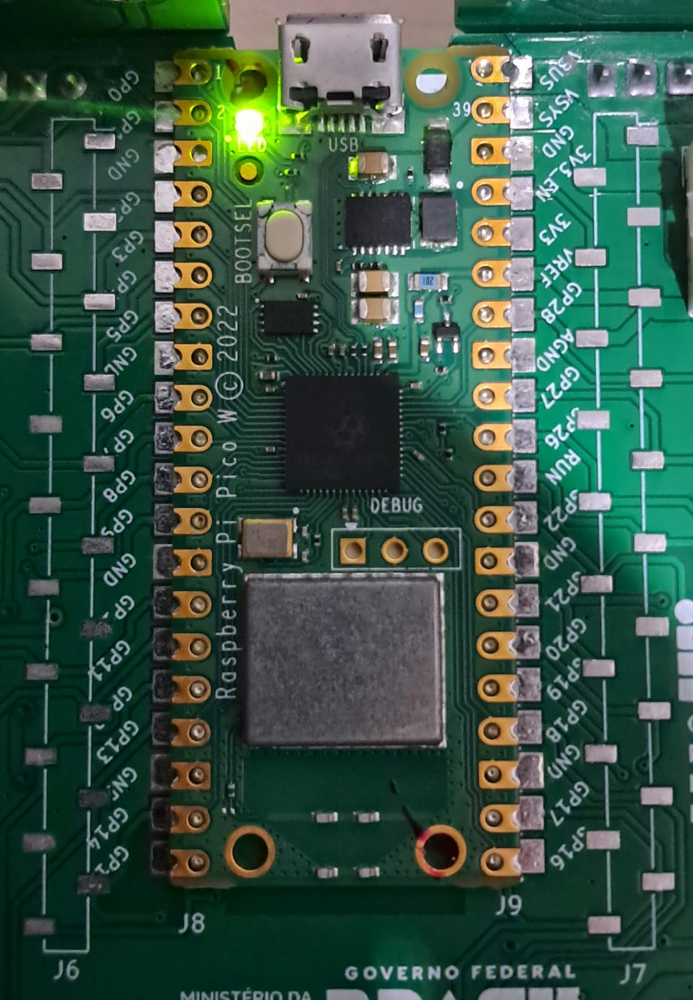

# Modular LED Blink

This program implements a blinking LED on the Raspberry Pi Pico W, using its built-in LED connected to the WiFi module.
The idea of this project was to develop knowledge and skills in modular programming, as can be seen from the file organization.

---

## Bill of Materials (BOM): 

| Component             | BitDogLab Connection      |
|-----------------------|---------------------------|
| Pi Pico W - RP2040    | -                         |

---

## Execution

1. Open the project in VS Code, using an environment with Raspberry Pi Pico SDK support (CMake + ARM compiler);
2. Build the project normally (Ctrl+Shift+B in VS Code or via terminal with `cmake` and `make`);
3. Connect your BitDogLab via USB cable and put the Pico into boot mode (hold the BOOTSEL button while plugging in the cable);
4. Copy the generated `.uf2` file to the storage drive that appears (RPI-RP2);
5. The Pico will automatically reboot and start executing the code;
 
Tip: Use the Raspberry Pi Pico extension in VS Code to import the program as a Pico project, using SDK 2.1.0.

---

## Files

- `src/app/main.c`: Main project code;
- `src/drivers/led_embutido.c`: Driver layer .c file;
- `src/hal/hal_led.c`: HAL layer .c file;
- `src/include/hal_led.h`: HAL layer .h file;
- `src/include/led_embutido.h`: Driver layer .h file;

- `assets/pico_led_blink.jpeg`: Operating program;
  
---

## 🖼️ Project Images

### Blinking built-in LED of the Pi Pico W:

---

## 📜 License
MIT License - MIT GPL-3.0.

---

# Pisca Led Modular

Este programa implementa um pisca led na Raspberry Pi Pico W, em seu led embutido ligado ao módulo WiFi.
A ideia neste projeto foi desenvolver o conhecimento e a habilidade de programação modular, conforme se pode notar pela organização dos arquivos.

---

##  Lista de materiais: 

| Componente            | Conexão na BitDogLab      |
|-----------------------|---------------------------|
| Pi Pico W - RP2040) | -                         |

---

## Execução

1. Abra o projeto no VS Code, usando o ambiente com suporte ao SDK do Raspberry Pi Pico (CMake + compilador ARM);
2. Compile o projeto normalmente (Ctrl+Shift+B no VS Code ou via terminal com cmake e make);
3. Conecte sua BitDogLab via cabo USB e coloque a Pico no modo de boot (pressione o botão BOOTSEL e conecte o cabo);
4. Copie o arquivo .uf2 gerado para a unidade de armazenamento que aparece (RPI-RP2);
5. A Pico reiniciará automaticamente e começará a executar o código;
 
Sugestão: Use a extensão da Raspberry Pi Pico no VScode para importar o programa como projeto Pico, usando o sdk 2.1.0.

---

##  Arquivos

- `src/app/main.c`: Código principal do projeto;
- `src/drivers/led_embutido.c`: .c da camada de driver;
- `src/hal/hal_led.c`: .c da camada de hal;
- `src/include/hal_led.h`: .h da camada de hal;
- `src/include/led_embutido.h`: .h da camada de driver;

- `assets/pico_led_blink.jpeg`: Programa operante;
  
---

## 🖼️ Imagens do Projeto

### Led embutido da Pi Pico W piscando:

---

## 📜 Licença
MIT License - MIT GPL-3.0.

---
