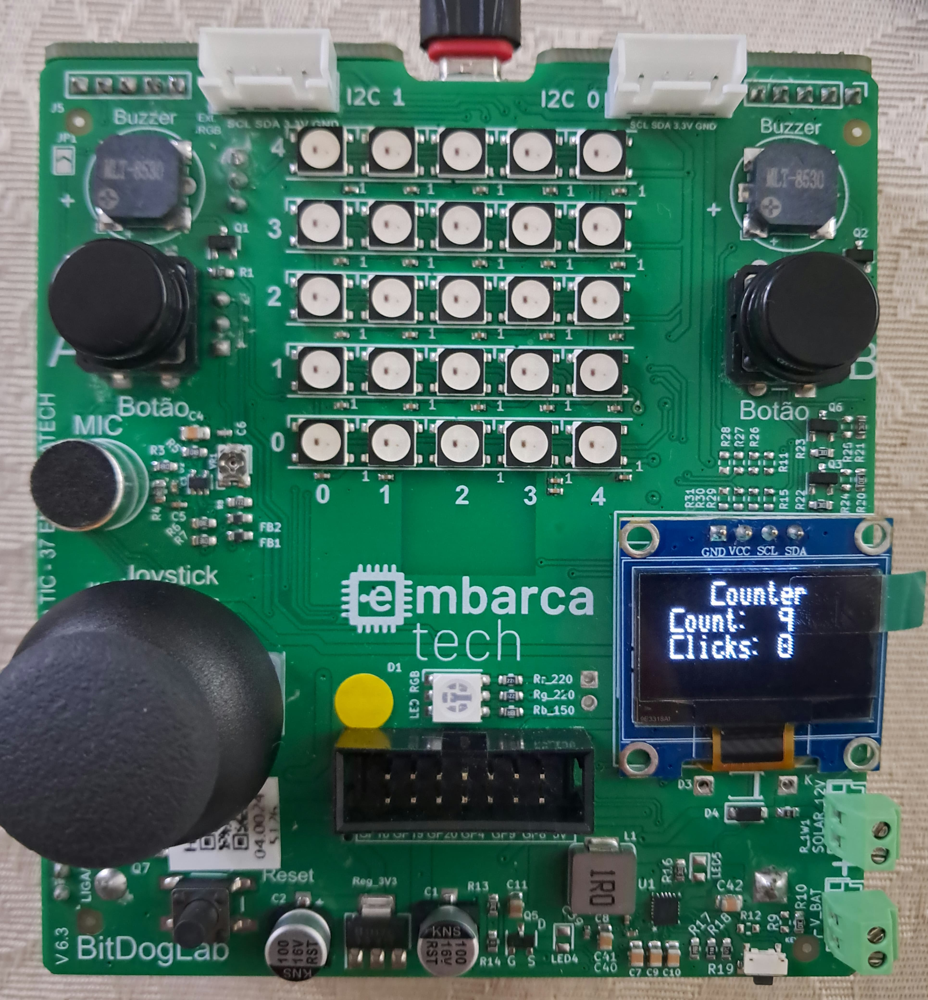

# Countdown Timer

This program implements a 9-second countdown timer, where the time is displayed on the OLED display (from 9 to 0) alongside the number of user clicks on button B.
 
In this program, button A starts a countdown from 9, and this value decreases subsequently until it reaches 0 (by one every second). While this countdown is running, the number of presses on button B is also counted.
These values (time and presses) are shown on the OLED display.
  
---

## Bill of Materials (BOM): 

| Component             | BitDogLab Connection      |
|-----------------------|---------------------------|
| BitDogLab (Pi Pico W - RP2040) | -                         |
| I2C OLED Display      | SDA: GPIO14 / SCL: GPIO15 |
| Buttons (two)         | GPIOs 5 and 6 (pull-up)   |

---

## Execution

1. Open the project in VS Code, using an environment with Raspberry Pi Pico SDK support (CMake + ARM compiler);
2. Build the project normally (Ctrl+Shift+B in VS Code or via terminal with `cmake` and `make`);
3. Connect your BitDogLab via USB cable and put the Pico into boot mode (hold the BOOTSEL button while plugging in the cable);
4. Copy the generated `.uf2` file to the storage drive that appears (RPI-RP2);
5. The Pico will automatically reboot and start executing the code;
 
Tip: Use the Raspberry Pi Pico extension in VS Code to import the program as a Pico project, using SDK 2.1.0.

---

## Files

- `src/contador_decrescente.c`: Main project code;
- `src/libraries/ssd1306_i2c.c`: I2C communication library .c file for the OLED display; 
- `src/libraries/inc/ssd1306.h`: .h file with function definitions for the OLED display I2C communication library (this is included in the main code);
- `src/libraries/inc/ssd1306_font.h`: Main project code;
- `src/libraries/inc/ssd1306_i2c.h`: I2C communication library .h file for the OLED display with definitions and structures;

- `assets/counter_demo1.jpeg`: Image of the BitDogLab operating with the counter post-countdown;
- `assets/counter_demo2.jpeg`: Image of the BitDogLab operating with the counter during countdown;
- `assets/counter_demo3.jpeg`: Image of the BitDogLab operating with the counter pre-countdown;

---

## 🖼️ Project Images

### Counter at 9 seconds, before starting:

### Counter in progress:

### Counter at 0 seconds, after finishing:

---

## 📜 License

MIT License - MIT GPL-3.0.

---

# Contador Decrescente

Este programa implementa um contador decrescente de 9 segundos, cujo tempo é apresentado no display OLED (de 9 a 0) acompanhado pelo número de cliques do usuário no botão B.
 
Neste programa, o botão A inicia uma contagem do 9, de modo que esse valor é decrescido subsequentemente até 0 (um em um segundo). Enquanto essa contagem ocorre, é contado também o número de pressionamentos do botão B
Esses valores (tempo e pressionamentos) são expostos no display OLED.
  
---

##  Lista de materiais: 

| Componente            | Conexão na BitDogLab      |
|-----------------------|---------------------------|
| BitDogLab (Pi Pico W - RP2040) | -                         |
| Display OLED I2C   | SDA: GPIO14 / SCL: GPIO15 |
| Botões (dois)      | GPIOs 5 e 6 (pull-up)|

---

## Execução

1. Abra o projeto no VS Code, usando o ambiente com suporte ao SDK do Raspberry Pi Pico (CMake + compilador ARM);
2. Compile o projeto normalmente (Ctrl+Shift+B no VS Code ou via terminal com cmake e make);
3. Conecte sua BitDogLab via cabo USB e coloque a Pico no modo de boot (pressione o botão BOOTSEL e conecte o cabo);
4. Copie o arquivo .uf2 gerado para a unidade de armazenamento que aparece (RPI-RP2);
5. A Pico reiniciará automaticamente e começará a executar o código;
 
Sugestão: Use a extensão da Raspberry Pi Pico no VScode para importar o programa como projeto Pico, usando o sdk 2.1.0.

---

##  Arquivos

- `src/contador_decrescente.c`: Código principal do projeto;
- `src/libraries/ssd1306_i2c.c`: .c da biblioteca de comunicação i2c com display OLED; 
- `src/libraries/inc/ssd1306.h`: .h com definições de voids da biblioteca de comunicação i2c com display OLED (esta é incluida no código principal);
- `src/libraries/inc/ssd1306_font.h`: Código principal do projeto;
- `src/libraries/inc/ssd1306_i2c.h`: .h da biblioteca de comunicação i2c com display OLED com definições e estruturas;

- `assets/counter_demo1.jpeg`: Imagem da bitlog operando com contador pós contagem;
- `assets/counter_demo2.jpeg`: Imagem da bitlog operando com contador durante contagem;
- `assets/counter_demo3.jpeg`: Imagem da bitlog operando com contador pré contagem;

---

## 🖼️ Imagens do Projeto

### Contador em 9 segundos, antes do início:

### Contador em progresso:

### Contador em 0 segundos, após o fim:

---

## 📜 Licença

MIT License - MIT GPL-3.0.

---
