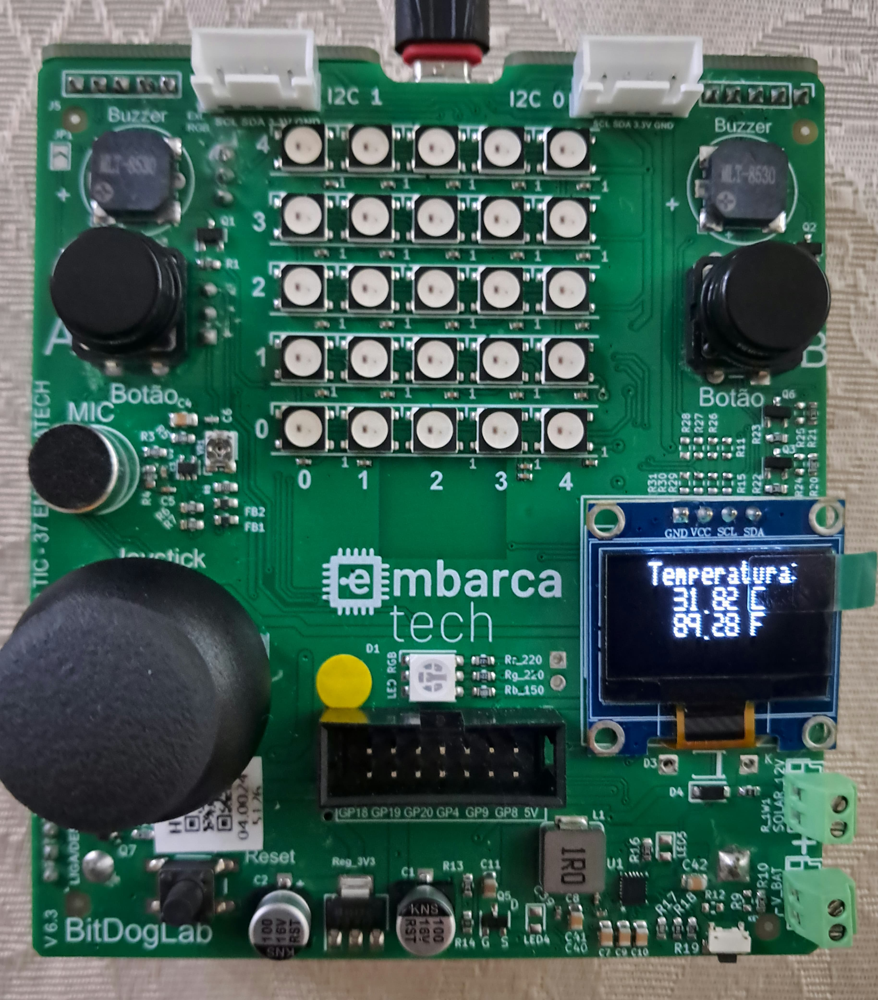

# Internal Temperature Reader

This program implements an internal temperature reader for the Pi Pico W MCU. In it, you can see the value read by the internal temperature ADC on the display in both Celsius and Fahrenheit. 
 

---

## Bill of Materials (BOM): 

| Component             | BitDogLab Connection      |
|-----------------------|---------------------------|
| BitDogLab (Pi Pico W - RP2040) | -                         |
| I2C OLED Display      | SDA: GPIO14 / SCL: GPIO15 |
---

## Execution

1. Open the project in VS Code, using an environment with Raspberry Pi Pico SDK support (CMake + ARM compiler);
2. Build the project normally (Ctrl+Shift+B in VS Code or via terminal with `cmake` and `make`);
3. Connect your BitDogLab via USB cable and put the Pico into boot mode (hold the BOOTSEL button while plugging in the cable);
4. Copy the generated `.uf2` file to the storage drive that appears (RPI-RP2);
5. The Pico will automatically reboot and start executing the code;
 
Tip: Use the Raspberry Pi Pico extension in VS Code to import the program as a Pico project, using SDK 2.1.0.

---

## Files

- `src/TLMGame.c`: Main project code;
- `src/libraries/ssd1306_i2c.c`: I2C communication library .c file for the OLED display;
- `src/libraries/inc/ssd1306.h`: .h file with function definitions for the OLED display I2C communication library (this is included in the main code);
- `src/libraries/inc/ssd1306_font.h`: Main project code;
- `src/libraries/inc/ssd1306_i2c.h`: I2C communication library .h file for the OLED display with definitions and structures;

- `assets/temperatura_demo.jpeg`: Image of the BitDogLab operating with the internal temperature reader;

---

## 🖼️ Project Images

### Temperature sensor in operation:

---

## 📜 License
MIT License - MIT GPL-3.0.

---

# Leitor de Temperatura Interna

Este programa implementa um leitor da temperatura interna da MCU da Pi Pico W. Nele, pode se ver no display o valor lido por ADC de temperatura interna tanto em Celsius como em Farenheit. 
 

---

##  Lista de materiais: 

| Componente            | Conexão na BitDogLab      |
|-----------------------|---------------------------|
| BitDogLab (Pi Pico W - RP2040) | -                         |
| Display OLED I2C   | SDA: GPIO14 / SCL: GPIO15 |
---

## Execução

1. Abra o projeto no VS Code, usando o ambiente com suporte ao SDK do Raspberry Pi Pico (CMake + compilador ARM);
2. Compile o projeto normalmente (Ctrl+Shift+B no VS Code ou via terminal com cmake e make);
3. Conecte sua BitDogLab via cabo USB e coloque a Pico no modo de boot (pressione o botão BOOTSEL e conecte o cabo);
4. Copie o arquivo .uf2 gerado para a unidade de armazenamento que aparece (RPI-RP2);
5. A Pico reiniciará automaticamente e começará a executar o código;
 
Sugestão: Use a extensão da Raspberry Pi Pico no VScode para importar o programa como projeto Pico, usando o sdk 2.1.0.

---

##  Arquivos

- `src/TLMGame.c`: Código principal do projeto;
- `src/libraries/ssd1306_i2c.c`: .c da biblioteca de comunicação i2c com display OLED;
- `src/libraries/inc/ssd1306.h`: .h com definições de voids da biblioteca de comunicação i2c com display OLED (esta é incluida no código principal);
- `src/libraries/inc/ssd1306_font.h`: Código principal do projeto;
- `src/libraries/inc/ssd1306_i2c.h`: .h da biblioteca de comunicação i2c com display OLED com definições e estruturas;

- `assets/temperatura_demo.jpeg`: Imagem da bitdog operando com leitor de temperatura interna;

---

## 🖼️ Imagens do Projeto

### Sensor de temperatura operando:

---

## 📜 Licença
MIT License - MIT GPL-3.0.

---
