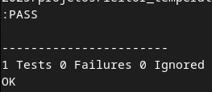

# ADC Reading to Celsius Conversion Function Test 

In this program, you can see an introduction to the unit testing process of a function using the Unity Test library.

---

## Bill of Materials (BOM): 

No materials are needed other than a computer.

---

## Execution

1. Use CMake inside `leitor_temperatura_teste/src/test/` to create the Makefile for the test program;
2. Run the `make` command;
3. Execute the `test_unity` output program.

---

## Files

- `leitor_temperatura_testado.c`: Code containing the function;
- `leitor_temperatura_testado.h`: .h file for using the function in the test program;
- `src/test/test.c`: Test program code;
- `src/unity/unity.c`: Test library code;
- `src/unity/unity.h`: Test library .h file;
- `src/unity/unity_internals.h`: Test library internal resources .h file;

- `assets/resposta_terminal.png`: Terminal output of the test program;

---

## 🖼️ Project Images

### Terminal output of the test program:

---

## 📜 License
MIT License - MIT GPL-3.0.

---

# Teste da Função de Conversão de Leitura do ADC em Celsius 

Neste programa, é possível observar uma introdução ao processo de teste unitário de uma função utilizando a biblioteca Unity Test.

---

##  Lista de materiais: 

Não é necessário material algum além de um computador.

---

## Execução

1. Use o CMake dentro de leitor_temperatura_teste/src/test/ para criar o MakeFile do programa de teste;
2. Execute um comando make;
3. Execute o programa de saída test_unity.

---

##  Arquivos

- `leitor_temperatura_testado.c`: Código contendo a função;
- `leitor_temperatura_testado.h`: .h da para uso da função no programa de teste;
- `src/test/test.c`: Código do programa de teste;
- `src/unity/unity.c`: Código da biblioteca de teste;
- `src/unity/unity.h`: .h da biblioteca de teste;
- `src/unity/unity_internals.h`: .h de recursos internos da biblioteca de teste;

- `assets/resposta_terminal.png`: Resposta do terminal ao programa de teste;

---

## 🖼️ Imagens do Projeto

### Resposta do terminal ao programa de teste:

---

## 📜 Licença
MIT License - MIT GPL-3.0.

---
