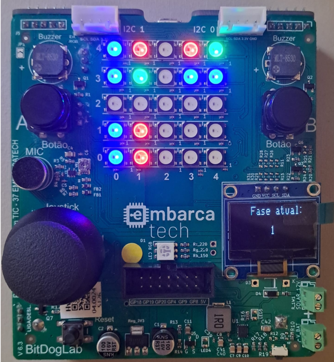
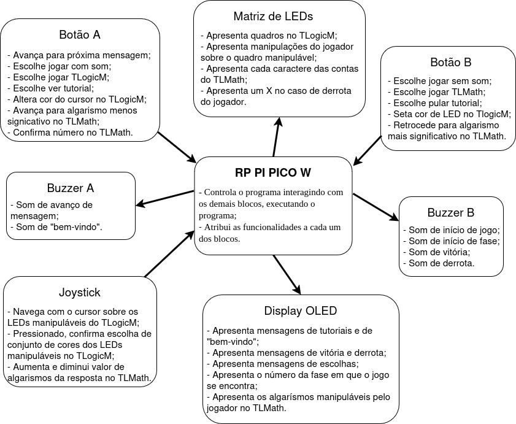
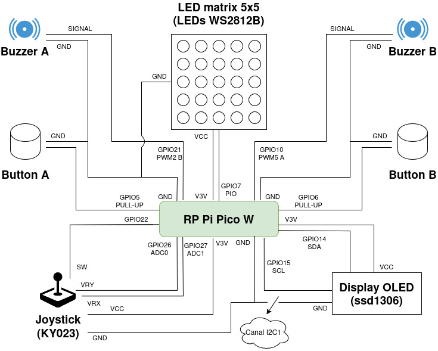
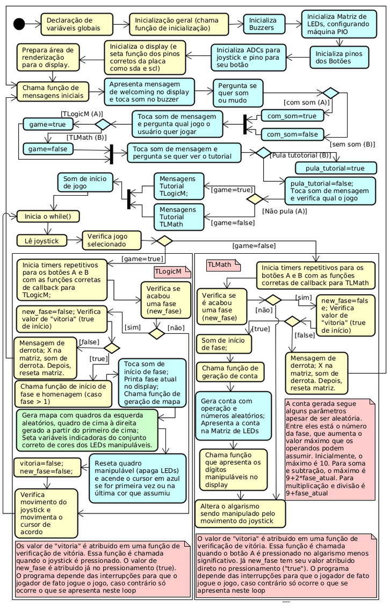
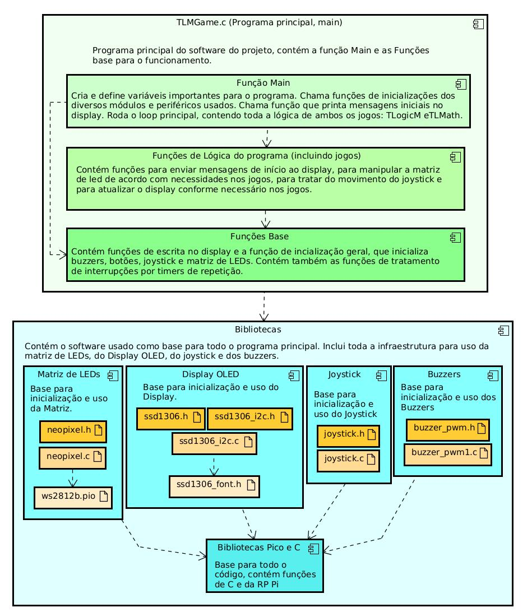

# TLMGame

TLMGame é um jogo que visa a atender a todo o público, apesar de ser de ótimo uso para crianças e adolescentes. Para tanto, o jogo traz diversão e aprendizado em conjunto na forma de testes de lógica e matemática, permitindo ao jogador que treine seu raciocínio lógico e fortaleça seu cérebro! 
 
 
O Programa é composto por dois jogos:
 <ul>
  <li>TLogicM: Neste jogo, o jogador é responsável por reproduzir a lógica de transformação do quadro da esquerda encima para o da direita em cima, de forma a formar o quadrado da direita embaixo usando a lógica de cima e o quadrado da esquerda de baixo! Tal lógica, pode ser dada por uma rotação de 90 graus nos sentidos anti-horário ou horário, uma rotação de 180 graus ou, finalmente, pela mudança de cores (como: vermelho vira azul e verde vira branco). Vale ressaltar, no entanto, que não podem ocorrer duas mudanças simultâneas de um quadro para o outro, ou seja, nunca haverá uma mudança de cor acompanhada por uma rotação.</li>
  <li>TLMath: Já neste, o jogador tem de ficar muito atento à conta apresentada em cada rodada e devolver ao programa o resultado que pensa ser o correto. Dessa maneira, a cada fase que o jogador passa (cada conta que acerta), o jogo aumenta sua dificuldade, de modo que as contas podem conter números progressivamente maiores, gerando, por consequência, resultados maiores e mais complexos de serem encontrados. Cabe notar que, a cada fase, há apenas uma operação: soma, subtração, multiplicação ou divisão. Nunca há mais que uma operação por fase! </li>
</ul> 

---

##  Lista de materiais: 

| Componente            | Conexão na BitDogLab      |
|-----------------------|---------------------------|
| BitDogLab (RP2040) | -                         |
| Buzzers MLT-8530   | GPIOs 10 e 21 como saídas PWM |
| Matriz WS2812B 5x5 | GPIO 7 com configuração PIO |
| Display OLED I2C   | SDA: GPIO14 / SCL: GPIO15 |
| Joystick           | GPIO 22 (pull-up), GPIOs 26 e 27 com ADC|
| Botões (dois)      | GPIOs 5 e 6 (pull-up)|

---

## Execução

1. Abra o projeto no VS Code, usando o ambiente com suporte ao SDK do Raspberry Pi Pico (CMake + compilador ARM);
2. Compile o projeto normalmente (Ctrl+Shift+B no VS Code ou via terminal com cmake e make);
3. Conecte sua BitDogLab via cabo USB e coloque a Pico no modo de boot (pressione o botão BOOTSEL e conecte o cabo);
4. Copie o arquivo .uf2 gerado para a unidade de armazenamento que aparece (RPI-RP2);
5. A Pico reiniciará automaticamente e começará a executar o código;
6. O histograma será atualizado no display OLED e os eventos simulados aparecerão na matriz de LEDs.
 
Sugestão: Use a extensão da Raspberry Pi Pico no VScode para importar o programa como projeto Pico, usando o sdk 2.1.0.

---

##  Arquivos

- `src/TLMGame.c`: Código principal do projeto;
- `src/libraries/buzzer_pwm.c`: .c da biblioteca para uso do buzzer com pwm;
- `src/libraries/buzzer_pwm.h`: .h da biblioteca para uso do buzzer com pwm;
- `src/libraries/joystick.c`: .c da biblioteca para uso do joystick com ADC;
- `src/libraries/joystick.h`: .h da biblioteca para uso do joystick com ADC;
- `src/libraries/neopixel.c`: .c da biblioteca para uso da matriz de leds com PIO;
- `src/libraries/neopixel.h`: .h da biblioteca para uso da matriz de leds com PIO;
- `src/libraries/ssd1306_i2c.c`: .c da biblioteca de comunicação i2c com display OLED;
- `src/libraries/ws2812b.pio`: .pio para comunicação com a matriz de leds; 
- `src/libraries/inc/ssd1306.h`: .h com definições de voids da biblioteca de comunicação i2c com display OLED (esta é incluida no código principal);
- `src/libraries/inc/ssd1306_font.h`: Código principal do projeto;
- `src/libraries/inc/ssd1306_i2c.h`: .h da biblioteca de comunicação i2c com display OLED com definições e estruturas;

- `assets/BLK_DIAG.jpg`: Diagrama de blocos de hardware;
- `assets/circuitos.jpg`: Diagrama de circuitos;
- `assets/flux_software.png`: Fluxograma do software;
- `assets/diagrama_camadas_soft.jpg`: Diagrama de camadas do software;
- `assets/placa_tlogicm.png`: Placa operando no jogo TLogicM.

---

## 🖼️ Imagens do Projeto

### BitDogLab operando no jogo TLogicM:

### Diagrama de blocos de hardware:

### Diagrama de circuitos:

### Fluxograma do software:

### Diagrama de camadas de software:

---

## 📜 Licença
MIT License - MIT GPL-3.0.

---
