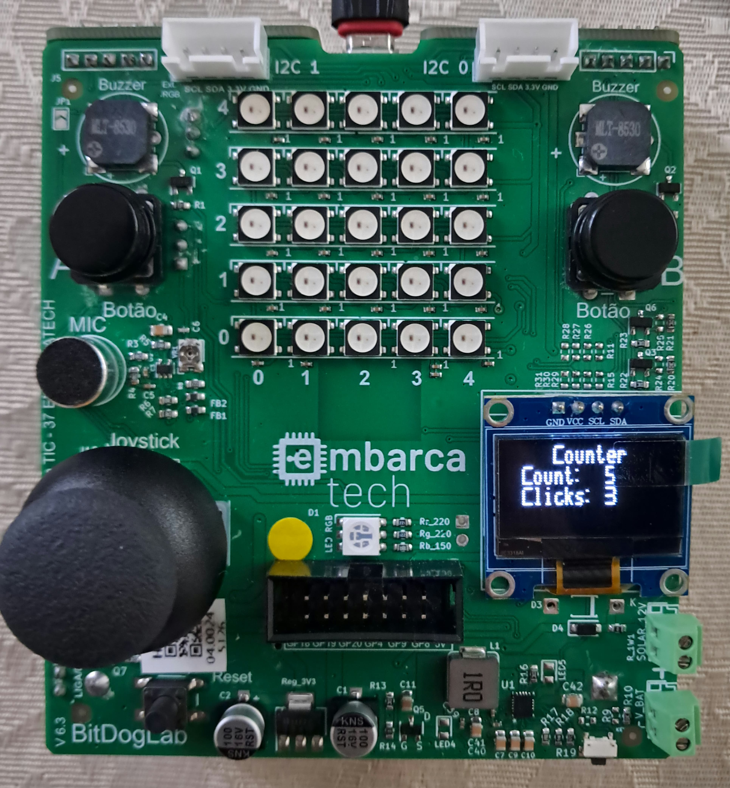
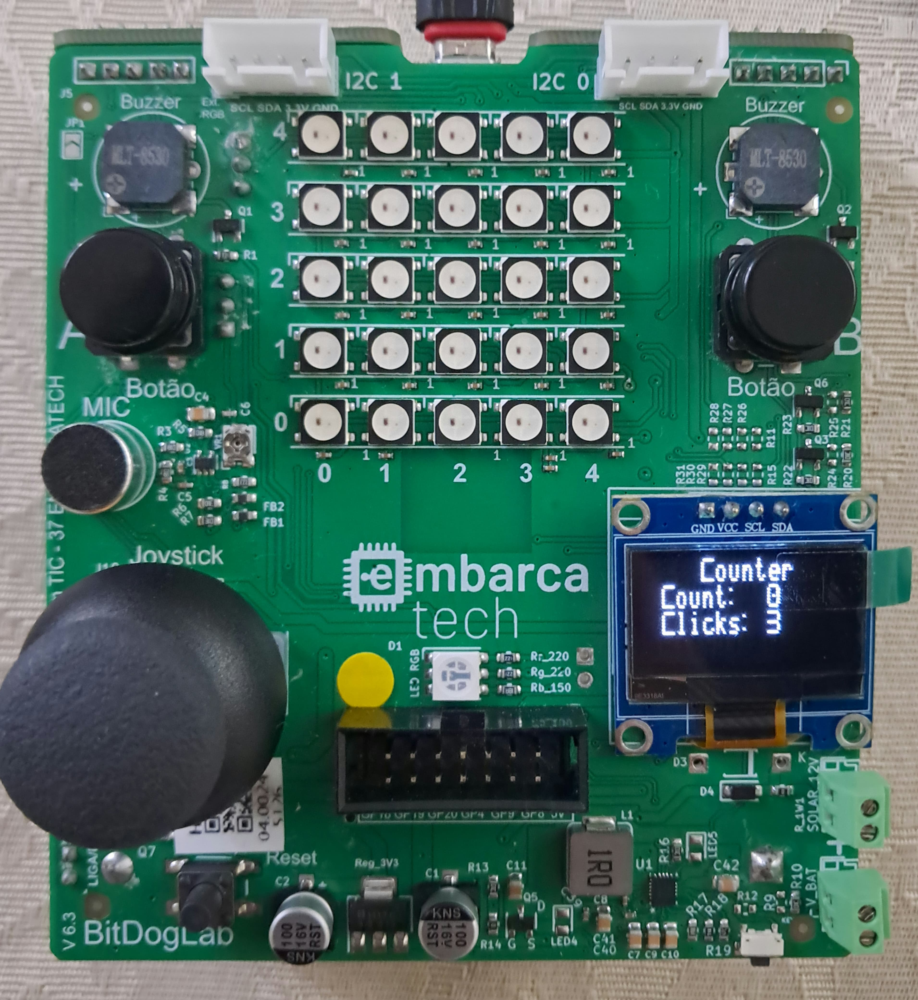

# Contador Decrescente

Este programa implementa um contador decrescente de 9 segundos, cujo tempo é apresentado no display OLED (de 9 a 0) acompanhado pelo número de cliques do usuário no botão B.
 
Neste programa, o botão A inicia uma contagem do 9, de modo que esse valor é decrescido subsequentemente até 0 (um em um segundo). Enquanto essa contagem ocorre, é contado também o número de pressionamentos do botão B
Esses valores (tempo e pressionamentos) são expostos no display OLED.
  
---

##  Lista de materiais: 

| Componente            | Conexão na BitDogLab      |
|-----------------------|---------------------------|
| BitDogLab (Pi Pico W - RP2040) | -                         |
| Display OLED I2C   | SDA: GPIO14 / SCL: GPIO15 |
| Botões (dois)      | GPIOs 5 e 6 (pull-up)|

---

## Execução

1. Abra o projeto no VS Code, usando o ambiente com suporte ao SDK do Raspberry Pi Pico (CMake + compilador ARM);
2. Compile o projeto normalmente (Ctrl+Shift+B no VS Code ou via terminal com cmake e make);
3. Conecte sua BitDogLab via cabo USB e coloque a Pico no modo de boot (pressione o botão BOOTSEL e conecte o cabo);
4. Copie o arquivo .uf2 gerado para a unidade de armazenamento que aparece (RPI-RP2);
5. A Pico reiniciará automaticamente e começará a executar o código;
 
Sugestão: Use a extensão da Raspberry Pi Pico no VScode para importar o programa como projeto Pico, usando o sdk 2.1.0.

---

##  Arquivos

- `src/contador_decrescente.c`: Código principal do projeto;
- `src/libraries/ssd1306_i2c.c`: .c da biblioteca de comunicação i2c com display OLED; 
- `src/libraries/inc/ssd1306.h`: .h com definições de voids da biblioteca de comunicação i2c com display OLED (esta é incluida no código principal);
- `src/libraries/inc/ssd1306_font.h`: Código principal do projeto;
- `src/libraries/inc/ssd1306_i2c.h`: .h da biblioteca de comunicação i2c com display OLED com definições e estruturas;

- `assets/counter_demo1.jpeg`: Imagem da bitlog operando com contador pós contagem;
- `assets/counter_demo2.jpeg`: Imagem da bitlog operando com contador durante contagem;
- `assets/counter_demo3.jpeg`: Imagem da bitlog operando com contador pré contagem;

---

## 🖼️ Imagens do Projeto

### Contador em 9 segundos, antes do início:

### Contador em progresso:

### Contador em 0 segundos, após o fim:

---

## 📜 Licença

MIT License - MIT GPL-3.0.

---
