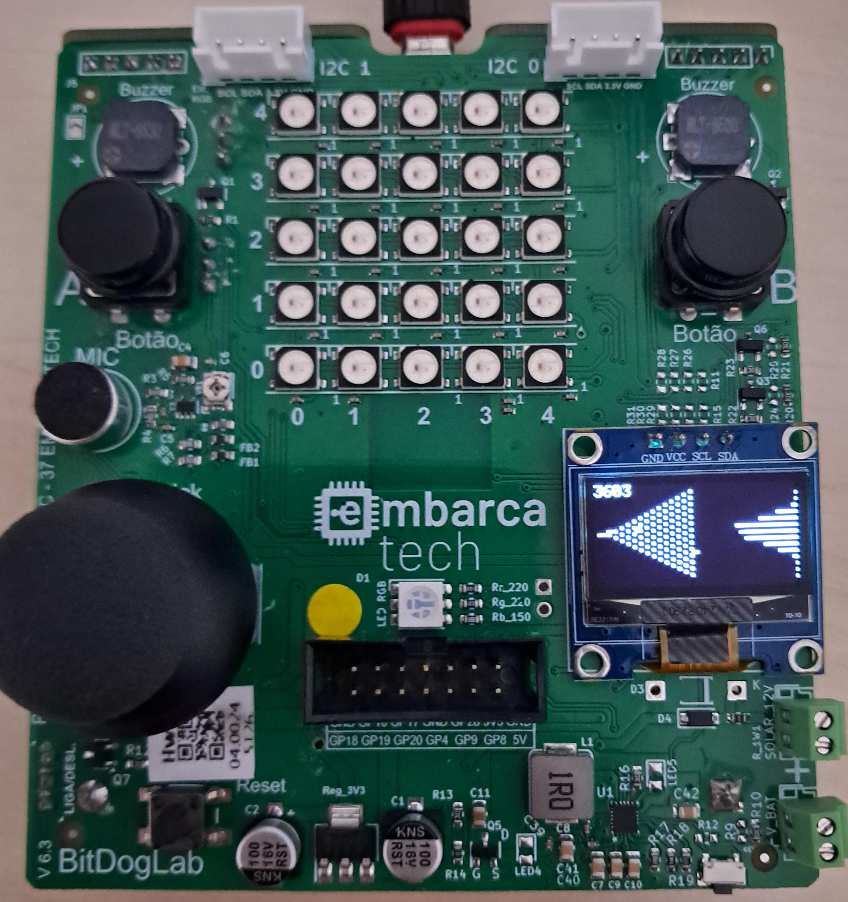

# Galton Board

Este programa implementa um digital twin do experimento Galton Board.

---

##  Lista de materiais: 

| Componente            | Conexão na BitDogLab      |
|-----------------------|---------------------------|
| BitDogLab (Pi Pico W - RP2040) | -                         |
| Display OLED I2C   | SDA: GPIO14 / SCL: GPIO15 |
| Botões (dois)      | GPIOs 5 e 6 (pull-up)|

---

## Execução

1. Abra o projeto no VS Code, usando o ambiente com suporte ao SDK do Raspberry Pi Pico (CMake + compilador ARM);
2. Compile o projeto normalmente (Ctrl+Shift+B no VS Code ou via terminal com cmake e make);
3. Conecte sua BitDogLab via cabo USB e coloque a Pico no modo de boot (pressione o botão BOOTSEL e conecte o cabo);
4. Copie o arquivo .uf2 gerado para a unidade de armazenamento que aparece (RPI-RP2);
5. A Pico reiniciará automaticamente e começará a executar o código;
 
Sugestão: Use a extensão da Raspberry Pi Pico no VScode para importar o programa como projeto Pico, usando o sdk 2.1.0.

---

##  Arquivos

- `src/app/main.c`: Código principal do projeto;
- `src/hal/ssd1306.c`: .c da biblioteca do OLED;
- `include/ssd1306.h`: .h da biblioteca do OLED;
- `include/fonts/font.h`: .h da fonte usada pela biblioteca do OLED;

- `assets/galton_board_operante.jpeg`: Galton Board funcionando;
---

## 🖼️ Imagens do Projeto

### BitDogLab operando Galton Board:

---

## 📜 Licença
MIT License - MIT GPL-3.0.

---
