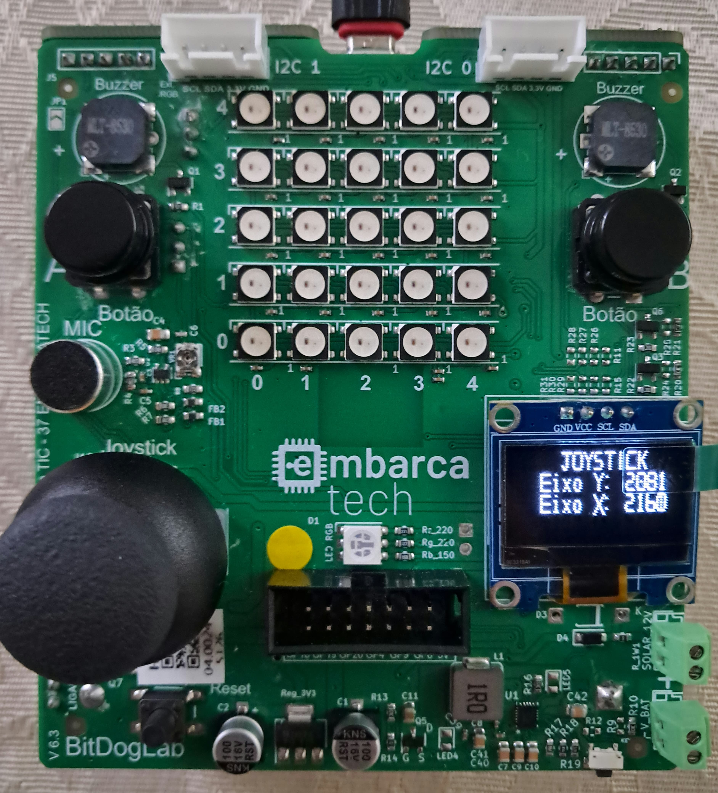

# Leitor de Joystick  

Este programa implementa um leitor de valores medidos pelo ADC receptor dos sinais do joystick disposto na BitDogLab.
Nele, o display OLED apresenta os valores lidos nos eixos Y e X, respectivamente.
 

---

##  Lista de materiais: 

| Componente            | Conexão na BitDogLab      |
|-----------------------|---------------------------|
| BitDogLab (Pi Pico W - RP2040) | -                         |
| Display OLED I2C   | SDA: GPIO14 / SCL: GPIO15 |
| Joystick           | GPIO 22 (pull-up), GPIOs 26 e 27 com ADC|

---

## Execução

1. Abra o projeto no VS Code, usando o ambiente com suporte ao SDK do Raspberry Pi Pico (CMake + compilador ARM);
2. Compile o projeto normalmente (Ctrl+Shift+B no VS Code ou via terminal com cmake e make);
3. Conecte sua BitDogLab via cabo USB e coloque a Pico no modo de boot (pressione o botão BOOTSEL e conecte o cabo);
4. Copie o arquivo .uf2 gerado para a unidade de armazenamento que aparece (RPI-RP2);
5. A Pico reiniciará automaticamente e começará a executar o código;
 
Sugestão: Use a extensão da Raspberry Pi Pico no VScode para importar o programa como projeto Pico, usando o sdk 2.1.0.

---

##  Arquivos

- `src/TLMGame.c`: Código principal do projeto;
- `src/libraries/joystick.c`: .c da biblioteca para uso do joystick com ADC;
- `src/libraries/joystick.h`: .h da biblioteca para uso do joystick com ADC;
- `src/libraries/ssd1306_i2c.c`: .c da biblioteca de comunicação i2c com display OLED;
- `src/libraries/inc/ssd1306.h`: .h com definições de voids da biblioteca de comunicação i2c com display OLED (esta é incluida no código principal);
- `src/libraries/inc/ssd1306_font.h`: Código principal do projeto;
- `src/libraries/inc/ssd1306_i2c.h`: .h da biblioteca de comunicação i2c com display OLED com definições e estruturas;

- `assets/joystick_demo.jpeg`: Imagem da Bitdog operando com o programa;

---

## 🖼️ Imagens do Projeto

### Leitor de Joystick:

---

## 📜 Licença
MIT License - MIT GPL-3.0.

---
